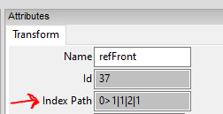
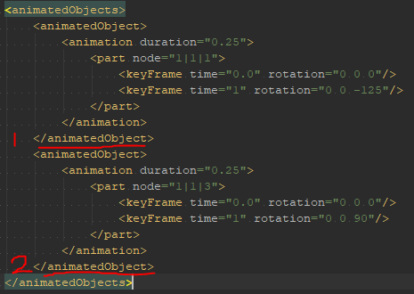

# Modding with Placeables

In this tutorial, you're going to learn how to add ManureSystem support to your placeable mod.

### What do I need?

To successfully execute the required steps in this tutorial you will need the following programs: 

- Text editor ([Notepad++](https://notepad-plus-plus.org/downloads/), [Visual Studio Code](https://code.visualstudio.com/) or any proper IDE ...)
- GIANTS Editor 8.2.0 or 3D software that supports the GIANTS Exporter (Maya, blender ...)
- Internet connection for downloading sources from GitHub

For placeables (non build-in map placeables) you also need an extra script in order to check if the `ManureSystem` exists.
You will need to get a copy of the latest `ManureSystemAvailabilityCheck.lua` file which can be found in the [GitHub repository](https://github.com/stijnwop/manureSystem/tree/master/docs/ManureSystemAvailabilityCheck.lua).

If the following [Download ManureSystemAvailabilityCheck](https://raw.githubusercontent.com/stijnwop/manureSystem/master/docs/ManureSystemVehicle.lua?token=AC3ZARBV53TJ7SBGI2KYODC6NK3BG) link does not work you can follow the following steps on how to download the `ManureSystemAvailabilityCheck.lua` file:
1. Go to the `docs` folder located in the root directory.
2. Click on the `ManureSystemAvailabilityCheck.lua` file.
3. A window will open with the script file.
4. Click on the button called `Raw` next to the `Blame` button and it will open the file in RAW format.
5. Right click and click on `save as` (or hit ctrl - s on your keyboard) and save the file to the preferred location in your mod.
 
> REMEMBER: Rename the file extension to `.lua` and don't save it as .txt!

## Adding the ManureSystemAvailabilityCheck
> **Warning: you can skip this step when you're not dealing with a standalone mod (so with build-in placeables)**

> In order to start with this step you need to have completed the part [What do I need?](https://github.com/stijnwop/manureSystem/blob/master/docs/PLACEABLES.md#what-do-i-need).

In this part of the tutorial we´re going to add an availability check, this is needed to ensure the user activated the `ManureSystem` mod in order to make our placeable fully functional!
If the `ManureSystem` isn't activated/available the `ManureSystemAvailabilityCheck.lua` will remove your placeable from the store in order to avoid possible errors for the end-user.

### Sourcing the availability check
In the previous part of the tutorial you downloaded the ManureSystemAvailabilityCheck script, in this part we're going to integrate this with your mod.

First you will need to open the `modDesc.xml` of your mod.
We will have to add the availability check to the `<extraSourceFiles>` tag of your modDesc. If your mod already has it just add the extra `<sourceFile>` entry.

This will result in something like:

```xml
<extraSourceFiles>
    <sourceFile filename="ManureSystemAvailabilityCheck.lua"/>
</extraSourceFiles>
```
The filename must be the exact location of the `ManureSystemAvailabilityCheck.lua` file you downloaded earlier. In this case it's loaded from the root directory of the mod.

We're done in the modDesc, your mod now does the availability check.

### Modifying the availability check
WOW, you heard that right! We're going todo some small scripting.

In the `ManureSystemAvailabilityCheck.lua` we need to modify the `storeItemXMLFile` variable in order to check for the correct xml file.
You will find this variable on line `13`.

This will look like:
```lua
-- Modify this name when dealing with other objects!
local storeItemXMLFile = "OUR_XML_FILENAME.xml"
```

Change `OUR_XML_FILENAME` from that variable to the name of your placeable xml filename.

For example in the FS19_manureSystemLagoon mod the xml filename is named `manureLagoon`. 
So this results in:
```lua
-- Modify this name when dealing with other objects!
local storeItemXMLFile = "manureLagoon.xml"
```

Thats it!

## Adding connectors
In order to be able to add connectors you have to make sure your placeable type is either:

- `husbandry` - vanilla placeable for animals husbandries.
- `bgaPlaceable` - vanilla placeable type for bga
- `FS19_manureSystem.manureSystemStorage` - storage script on the manure system

How you can setup the `FS19_manureSystem.manureSystemStorage` will be handled in the [chapter below](https://github.com/stijnwop/manureSystem/blob/master/docs/PLACEABLES.md#adding-manuresystemstorage-support).

### Connector types
Connectors are needed to tell for example hoses or fillarms where to connect to. Simply said it bridges functions together.

Currently the mod supports 4 types of connectors:

- COUPLING (manure hose coupling)
- COUPLINGFERTILIZER (fertilizer hose coupling)
- DOCK (funnel)
- OPTICAL (as the name already suggests non functional, just optical)

#### Couplings
In our first example we're going to look at adding a COUPLING connector type to our placeable, this example also works for the COUPLINGFERTILIZER type.

##### Adding the connector node
Open the placeable XML and add the `<manureSystemConnectors` tag as child of the `placeable` tag.

> Note: when dealing with BGA placeables the `<manureSystemConnectors` needs to be a child of the `<bga></bga>` tag like:
> ```xml
> <bga>
> ...
>     <manureSystemConnectors>
>     ...
>     </manureSystemConnectors>
> ...
> </bga>
> ```

Our step will result into this:
```xml
<manureSystemConnectors>
..
</manureSystemConnectors>
```

Replace the .. (dots) with a connector entry.
For our first connector entry we're going to use an existing reference transform group from the i3d file.
For that we open the i3d file and copy the index of the desired node. 

> **Note: placeables don't work with i3d mappings so we have to use node indexes in this case!**



Now that we found our node and copied the index we have to add a connector entry to the `<manureSystemConnectors` tag.

The result will look something like this:
```xml
<manureSystemConnectors>
    <connector type="COUPLING" node="1|1|2|1"/>
</manureSystemConnectors>
```
Note that I removed 0> from the index, this is not used on placeables in general!

This tells the `ManureSystem` mod that the node on index `1|1|2|1` is a COUPLING for manure hoses.

We can also use the option to tell the `ManureSystem` to create a node (as mentioned in other tutorials).
> **Tip: trough the entire mod you have the option to create a node with the `createNode` attribute or the option to refer to an existing node with the `node` attribute.**

This will look something like this:
```xml
<manureSystemConnectors>
    <connector type="COUPLING" linkNode="0|3" createNode="true" position="3.7 0.5 0.85" rotation="0 90 0" />
</manureSystemConnectors>
```

This will create a COUPLING node linked to the node on the index `0|3` with the given position and rotation.


> **Tip: in order to verify that the node is on the correct position I suggest you to look ingame and use the console command `msToggleDebug` this will highlight all the connector nodes used.**
> 

##### Adding connector animations

The connector types COUPLING and COUPLINGFERTILIZER support animation support for locking and opening the manure flow.
This is done over the AnimatedObjects entries.

***For the sake of the tutorial I assume you know how to add AnimatedObject entries.***

For object animations the connector supports two entries:

- lockAnimationIndex: `int` e.g. `1` this is the index of the animatedObject entry in the xml
- manureFlowAnimationIndex: `int` e.g. `1` this is the index of the animatedObject entry in the xml

For the example I added two simple animation entries that rotate a node on a given keyFrame.

These look like this (DON'T BLINDLY COPY):
```xml
<animatedObjects>
    <animatedObject>
        <animation duration="0.25">
            <part node="1|1|1">
                <keyFrame time="0" rotation="0 0 0"/>
                <keyFrame time="1" rotation="0 0 50"/>
            </part>            
        </animation>
    </animatedObject>
    <animatedObject>
        <animation duration="0.25">
            <part node="1|1|3">
                <keyFrame time="0" rotation="0 0 0"/>
                <keyFrame time="1" rotation="0 0 90"/>
            </part>
        </animation>
    </animatedObject>
</animatedObjects>
```



Above we have two animationObject entries which we can count as 1 and 2 (you can simply count the `</animatedObject>` (ending) tags)

In order to trigger the animation on our connectors we have to set the index we just counted on either the `lockAnimationIndex` or `manureFlowAnimationIndex` attribute.
This will result in the following entry.

```xml
<manureSystemConnectors>
    <connector type="COUPLING" node="1|1|2|1" lockAnimationIndex="1" manureFlowAnimationIndex="2"/>
</manureSystemConnectors>
```

In the example above the animatedObject with index `1` will be played for the lock animation and the animatedObject with index `2` will be played for the manure flow.

##### Configuring additional connector options

For placeable objects there are two additional attributes you can set on the connectors.

For the COUPLING and COUPLINGFERTILIZER type you have to option to set:

- inRangeDistance `int` e.g. `1.8` This determines the distance till the hose can be connected (handy for increasing attach/detach possibilities on hard to reach places)
- isParkPlace: `true/false` This flags if the connector is just used to park the hose on.

## Adding ManureSystemStorage support
> Before you continue make sure you finished adding the ManureSystemAvailabilityCheck in [Adding the ManureSystemAvailabilityCheck](https://github.com/stijnwop/manureSystem/blob/master/docs/PLACEABLES.md#adding-the-manuresystemavailabilitycheck).

Open your placeable xml file again.

In order to load the ManureSystemStorage you will have to set the following placeableType.

```xml
<placeableType>FS19_manureSystem.manureSystemStorage</placeableType>
```

The added ManureSystemAvailabilityCheck will make sure that the mod won't conflict when the `ManureSystem` isn't loaded.

In order to setup the bare minimum for the storage you will need to add the `<storage>` entry.

The options for the storage entry are:
- node: `string` e.g. `1|2` The node index of the storage.
- fillTypeCategories: `string` e.g. `slurryTank` The supported filltype categories.
- fillTypes: `string` e.g. `liquidManure` The supported fillType (ONLY NEEDED WHEN YOU WANT TO SPECIFY SPECIFIC FILLETYPES)
- capacityPerFillType: `int` e.g. `500` The capacity of the storage.


We also need a `<trigger>` entry in order to show the player info on our storage. This is simply a `node` reference to the trigger in your mod i3d.

Make sure the trigger is actually checked as `trigger` in the i3d and has a collision mask (HEX) of `100000`.

And example entry will be:
```xml
<manureSystemStorage>
    <trigger node="1|4"/>
    <storage node="0" fillTypeCategories="slurryTank" capacityPerFillType="1718000"/>
</manureSystemStorage>
```

If the storage has a fillplane you can configure the following on the `<fillPlane>` entry.
- node: `string` e.g. `1|2` The node index of the visible plane.
- planeMinY: `float` e.g. `-4.1` The min Y the plane can travel.
- planeMaxY: `float` e.g. `0.5` The max Y the plane can travel.
- planeOffsetY: `float` e.g. `0.1` The offset Y for fill arms.

And example entry with fillplane will be:
```xml
<manureSystemStorage>
    <fillPlane node="1|2" planeMinY="-3.6" planeMaxY="0.28"/>
    <storage node="0" fillTypeCategories="slurryTank" capacityPerFillType="1718000"/>
</manureSystemStorage>
```

The storage also has a couple of options we can configure for the mixer.

- hasMixer: `true/false` Sets if the storage has a mixer
- mixPerSecond: `int` e.g. `150` The amount of liters it can mix per second.

When the hasMixer is set to `true` we have to option to add sounds and animationNodes for that, like know from vanilla implementations.

A complete entry would look something like this:

```xml
<manureSystemStorage hasMixer="true" mixPerSecond="150">
    <fillPlane node="1|2" planeMinY="-3.6" planeMaxY="0.28" detectionNode="1|3"/>
    <storage node="0" fillTypeCategories="slurryTank" capacityPerFillType="1718000"/>
    <trigger node="1|4"/>
    <animationNodes>
        <animationNode node="2|0" rotSpeed="-2700" rotAxis="1" turnOnFadeTime="2" turnOffFadeTime="5"/>
    </animationNodes>
    <sounds>
        <mix template="FORAGE_WAGON_01" linkNode="2"/>
    </sounds>
</manureSystemStorage>
```

The example above includes sounds and animation nodes for the mixer.
